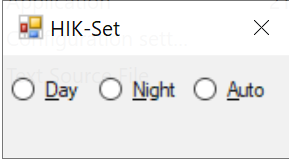

# Hikvision-Set

Hik-Set is a simple utility to change Day/Night/Auto mode of 1-2 Hikvision camera. Used for controlling day/night mode of https://stratuseeg.com/ cameras. NO RESPONSIBILITY TAKEN FOR USE!


## Version history
- Planned .NET5 version
- 2021-10-12 v1.4.0 Maximize button, height option. 
- 2021-08-08 v1.3.0 Displaying time on title. Net 4.5.2. Visual Studio 16.11.0.
- 2021-06-10 v1.2.4 Visual Studio 16.10.1. Security ClickOnce disabled. 
- 2021-03-27 v1.2.2 Trim line. Compiled with Visual Studio 16.9.2.
- 2021-03-14 v1.2.1 Option to set title. Compiled with Visual Studio 16.9.1.
- 2021-03-01 v1.2.0 Option to set location. Start with Auto selected. Compiled with Visual Studio 16.8.6. No ClickOnce sign.
- 2021-02-16 v1.1.4. Compiled with Visual Studio 16.8.5. Renamed repository as Hikvision instead of HikVision-Set.
- 2020-11-29 v1.1.3 Writing separate log each computer. Using computer specific settings if exist.
- 2020-11-19 v1.1.2 Log with fewer rows.
- 2020-11-18 v1.1.0 Using .ini and writing .log.
- 2020-11-08 v1.0.0 First version.



It is based on https://www.hikvision.com/en/support/download/sdk/device-network-sdk--for-windows-64-bit-/ version V6.1.6.3_build20200925 (Current SDK version V6.1.6.45_build20210302 has not been tested). and sample 1-Preview-PreviewDemo. CHCNetSDK.cs is from SDK. From CHCNetSDK.cs all ..\bin paths are removed:
```
...
[DllImport(@"HCNetSDK.dll")]
public static extern bool NET_DVR_Init();
...
```
All necessary DLLs (6.1.6.3 and libeay, ssleay 1.0.2.20) from SKDs\lib are included in project \bin folder. Stratus is using DLLs 6.1.4.6. 
```
HCCore.dll
HCNetSDK.dll
libeay32.dll
ssleay32.dll
HCNetSDKCom\HCCoreDevCfg.dll
HCNetSDKCom\HCPreview.dll
```
Visual Studio 2019 was used to compile this for x64 and .NET4.5 (you must have it installed). 

## Install

Download newest build as zip from https://github.com/jussivirkkala/Hikvision/archive/main.zip and start HIK-Set.exe from unzipped bin folder. You can download also certain release e.g. https://github.com/jussivirkkala/Hikvision/archive/v1.2.0.zip. Remember first to set correct parameters (IP, port, username, password) in HIK-Set.ini.
```
# Comment line
# Camera 1, IP, port
192.168.106.5
8000
admin
password
# Camera 2, If 1 camera use port 0
192.168.106.6
8000
admin
password
# Location x, y. If omitted or not >0 then center of screen
0
0
# Title, use e.g. HH:mm:ss. If omitted exe name
Ti\tle HH:mm:ss
# Height, 0 default, reduce from 165 to e.g. 110 or 70
110
```
In .ini all rows starting with # are ignored. White spaces are trimmed. If you only have one camera set port number of camera 2 to 0. You can also rename HIK-Set.exe and HIK-Set.ini to more descriptive name e.g CameraSet. Log file .log is appended automatically. When application is closed Auto mode command is transmitted. Application stays always on top and has opacity of 5%. Preset commands are: 39 Day mode (IR cut filter in), 40 Night mode (IR cut filter out), 46 Day/Night Auto Mode.

Tested with DS-2DE2204IW-DE3 https://www.hikvision.com/en/products/IP-Products/PTZ-Cameras/Value-Series/DS-2DE2204IW-DE3-W/ (see manual from there) with V5.6.11 build 190416 with Stratus software. Please provide feedback by making an issue or through tweet https://twitter.com/jussivirkkala.

End
